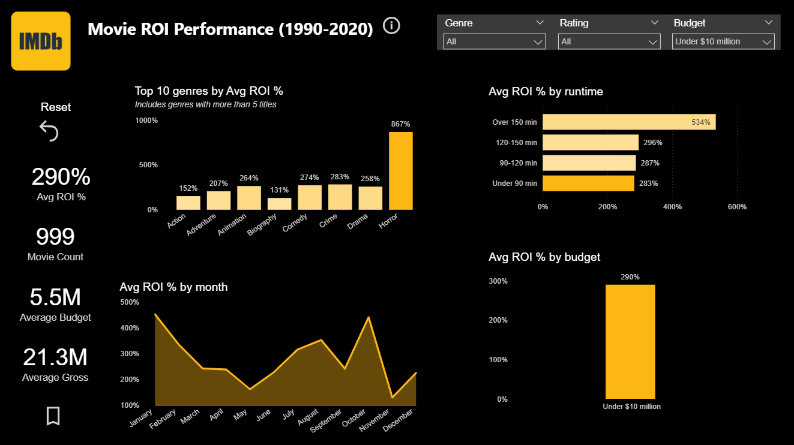
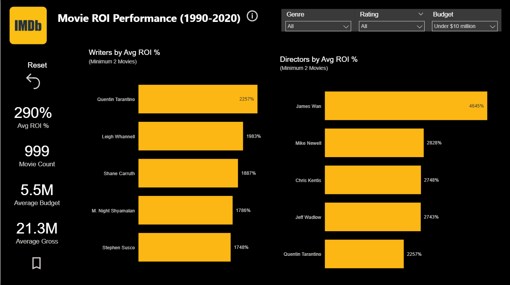

# How to Make 10X Your Investment in Movie Production

## Overview:
This project aims to help a fictional movie studio, Fledgling Movie Studio, maximize Return on Investment (ROI) for its upcoming movies. Using a portfolio-based ROI approach, the report provides insights and recommendations based on analysis of various factors such as genre, release date, budget, runtime, writers, and directors.

---

## 🔥 Key Findings

- Low-budget horror films (≤ $10M) generate **872% ROI**, making them the most profitable category  
- PG-13 horror films outperform R-rated films (**1197% vs. 759% ROI**)  
- Movies with runtimes between **90–120 minutes** produce the highest returns  
- **October, April, January, and February** are the strongest release months  
- Collaborations between **James Wan and Leigh Whannell** generate approximately **4600% ROI**

---

## 📄 Full Report

👉 [View Full Report](report/movie_roi_analysis_report.pdf)

---

## 📊 Dashboard

👉 [Download Dashboard (.pbix)](dashboard/movie_roi_dashboard.pbix)

Note: Open in Power BI Desktop to explore the full interactive dashboard.

---

## 🖼 Dashboard Preview

### Main Analysis (Budget ≤ $10M)

### Writers & Directors Analysis

---

## 🧠 Methodology

- Data cleaned and standardized using **Excel**  
- Data analyzed and transformed using **SQL**  
- Portfolio-level ROI used instead of per-film averages  
- Extreme outliers removed:
  - Blair Witch Project (~414,299%)
  - Paranormal Activity (~1,288,939%)  
- Minimum sample thresholds applied for reliability  

---

## 📎 Data Source

Movies Dataset (7,000+ films)  
https://www.kaggle.com/datasets/danielgrijalvas/movies

---

## 🛠 Tools Used

- SQL Server  
- Power BI  
- Excel

